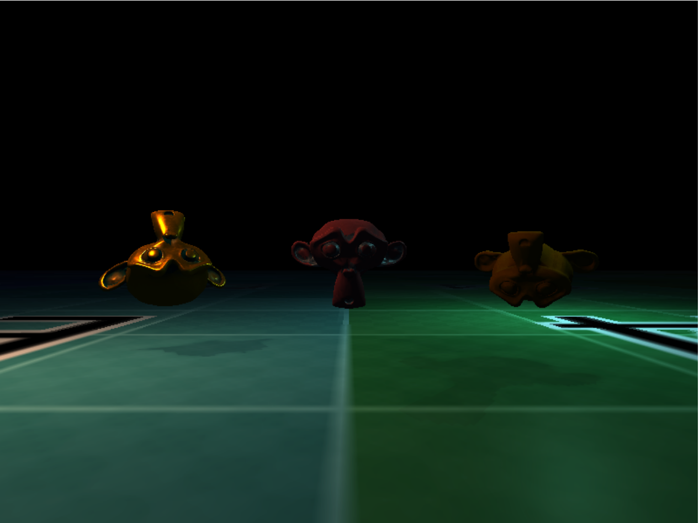
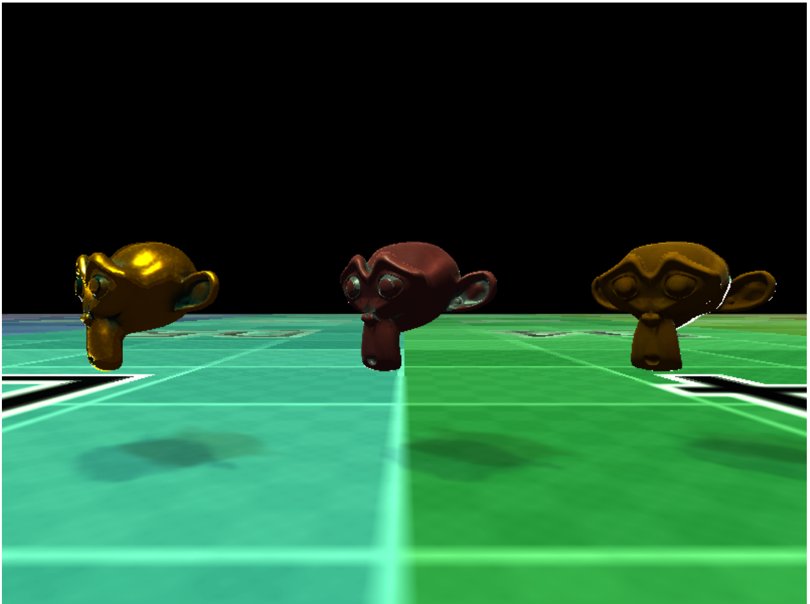

# What is this?
A webgl based deferred rendering engine that supports asset loading,
cook-torrance lighting, model loading, variance shadowmapping

# How to Use

* Navigate to the `index.html` file in your web browser.
* Select the scene you want to load and click the render button
* If nothing happens click the render button again

# Sources
 
* Deferred Rendering:           http://www.codinglabs.net/tutorial_simple_def_rendering.aspx
* Cook-Torrance Broad Strokes:  http://www.codinglabs.net/article_physically_based_rendering_cook_torrance.aspx
* Realtime Hard Shadows:        https://learnopengl.com/Advanced-Lighting/Shadows/Shadow-Mapping
* Model Loading:                http://www.assimp.org/
* Variance Shadow Mapping:      http://www.punkuser.net/vsm/vsm_paper.pdf
* Everything: http://codeflow.org/entries/2012/aug/25/webgl-deferred-irradiance-volumes/

# Screenshots

## Point Lights

## Directional  Lights

